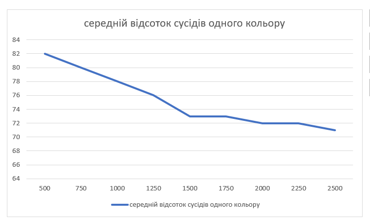
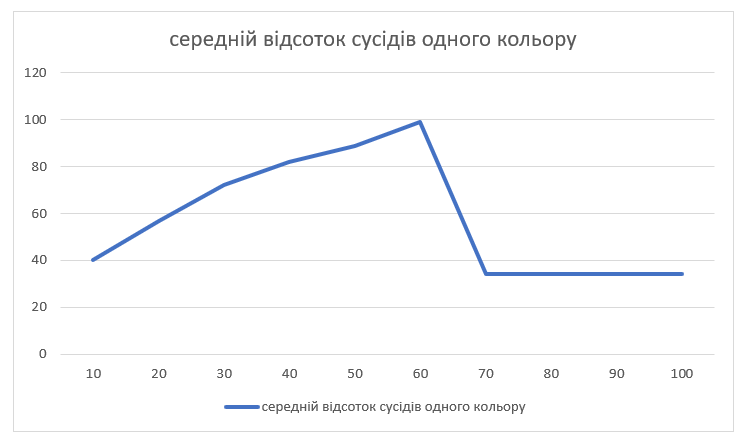
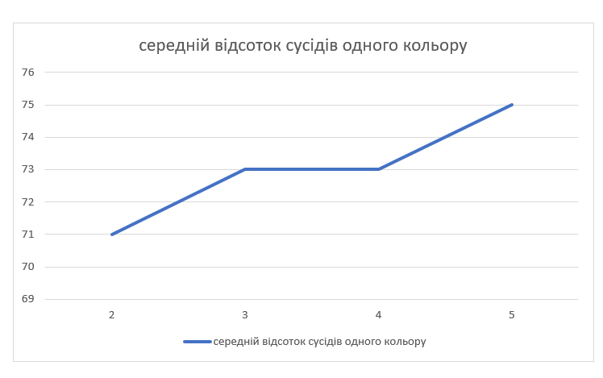

## Комп'ютерні системи імітаційного моделювання

## СПм-22-5, **Зубенко Сергій Петрович**

### Лабораторна робота №**1**. Опис імітаційних моделей та проведення обчислювальних експериментів

 

### Варіант 8, модель у середовищі NetLogo:

[Segregation Simple Extension 1.](http://www.netlogoweb.org/launch#http://www.netlogoweb.org/assets/modelslib/IABM%20Textbook/chapter%203/Segregation%20Extensions/Segregation%20Simple%20Extension%201.nlogo)

 

### Вербальний опис моделі:

Це модель взаємодії черепах різних етнічних груп в уявній водоймі. Усі черепахи взаємодіють між собою, проте кожна з них прагне переконатися, що вона проживає поруч із "своєю" групою. В рамках моделі представлено групу черепах (агентів), які переміщуються по патчах у двовимірному світі. Кожна черепаха має власний колір, і її задоволення залежить від відсотка сусідів із аналогічним кольором.

### Керуючі параметри:

- **number**: цей параметр визначає загальну кількість черепах, які будуть розміщені біля ставу під час налаштування (SETUP). Більше черепах може призвести до більш складної динаміки взаємодії між ними.
- **%-similar-wanted**: цей параметр визначає процент сусідів того самого виду, якого кожна черепаха бажає мати. Вищий відсоток призводить до більшої схильності до сегрегації.
- **number-of-ethnicities**: цей параметр визначає кількість різних видів черепах у популяції, кожен з яких матиме свій унікальний колір. Він впливає на різноманітність черепах в ставі.
  
### Внутрішні параметри:

-   **percent-similar**: відображає середній відсоток однокольорових сусідів для кожної черепахи. Він стартує приблизно зі значенням 0.5, оскільки кожна черепаха має (у середньому) однакову кількість червоних і зелених черепах як сусідів.
-   **percent-unhappy**: відображає відсоток черепах, які мають менше однокольорових сусідів, ніж вони бажають, і тому бажають змінити своє розташування. Обидва монітори також графічно відображаються для аналізу даних під час симуляції.
-   **colors**: це список кольорів, які використовуються для розфарбовування черепах у системі. Він використовується при наданні кожній черепахі її власного кольору в процедурі setup.
-   **happy?**: для кожної черепахи вказує, чи є принаймні подібний бажаний відсоток сусідів цієї черепахи того самого кольору, що й черепаха.
-   **similar-nearby**: вказує скільки сусідніх патчів мають черепах такого ж кольору
-   **total-nearby**: вказує скільки сусідніх ділянок має черепах

### Показники роботи системи:

-   **Percent Similar**: графік та монітор, які показують середній відсоток сусідів одного кольору для кожної черепахи. Він починається приблизно з 0,5, оскільки кожна черепаха починає (в середньому) з рівною кількістю червоних і зелених черепах як сусідів.
-   **Percent Unhappy**: графік та монітор, які показують відсоток черепах, які мають менше сусідів однієї етнічної приналежності, ніж вони хочуть (і тому хочуть переїхати).

 

### Примітки:

- Згодом кількість нещасних черепах зменшується. Але ставок стає більш відокремленим, з кластерами кожної етнічної групи.
- Під час налаштування, черепахи випадковим чином розташовуються у ставку. Однак багато з них почувають себе «нещасливими», оскільки їм не вдається знайти сусідів своєї національності. Нещасливі черепахи переселяються на нові місця поруч. Але на нових місцях вони можуть викликати дисбаланс у місцевій популяції, що примушує інших черепах відходити. 

### Недоліки моделі

- Модель не враховує можливості зміни розміру популяції черепах з часом. Це обмеження може впливати на реалістичність симуляції, оскільки в природі кількість представників популяції може змінюватися від часу до часу.
- Модель не враховує можливість конкуренції між різними етнічними групами черепах. У природі взаємодія між різними популяціями може включати конкуренцію за ресурси, але цей аспект відсутній у розглядуваній моделі.
- Модель описує переміщення черепах на нові місця, але не розглядає можливих наслідків цього переселення для місцевої популяції та її екосистеми.

 

## Обчислювальні експерименти

### 1. Вплив загальної кількості черепах на середній відсоток сусідів одного кольору

Досліджується залежність середнього відсотка сусідів одного кольору від загальної кількості черепах.
Експерименти проводяться при 500-2500 черепах, з кроком 250, усього 9 симуляцій.
Інші керуючі параметри мають значення за замовчуванням:

-   **%-simular-wanted**: 30;
-   **number-of-ethnicities**: 3;

<table>
<thead>
<tr><th>кількість черепах</th><th>середній відсоток сусідів одного кольору</th></tr>
</thead>
<tbody>
<tr><td>500</td><td>82</td></tr>
<tr><td>750</td><td>80</td></tr>
<tr><td>1000</td><td>78</td></tr>
<tr><td>1250</td><td>76</td></tr>
<tr><td>1500</td><td>73</td></tr>
<tr><td>1750</td><td>73</td></tr>
<tr><td>2000</td><td>72</td></tr>
<tr><td>2250</td><td>72</td></tr>
<tr><td>2500</td><td>71</td></tr>
</tbody>
</table>

Графік наочно показує, що зі збільшенням загальної кількості черепах в ставу спостерігається зменшення середнього відсотка сусідів одного кольору. Але середній відсоток сусідів одного кольору залишається відносно високим навіть при великих кількостях черепах. Це може свідчити про те, що черепахи мають тенденцію формувати групи за кольором, незважаючи на загальну кількість популяції.

### 2. Вплив відсотку бажаних сусідів на середній відсоток сусідів одного кольору:

Досліджується залежність середнього відсотка сусідів одного кольору від загальної кількості черепах.
Експерименти проводяться при 10-100 відсотку бажаних сусідів, з кроком 10, усього 10 симуляцій.
Інші керуючі параметри мають значення за замовчуванням:

-   **number**: 2000;
-   **number-of-ethnicities**: 3;

<table>
<thead>
<tr><th>відсотку бажаних сусідів</th><th>середній відсоток сусідів одного кольору</th></tr>
</thead>
<tbody>
<tr><td>10</td><td>40</td></tr>
<tr><td>20</td><td>58</td></tr>
<tr><td>30</td><td>78</td></tr>
<tr><td>40</td><td>82</td></tr>
<tr><td>50</td><td>91</td></tr>
<tr><td>60</td><td>99</td></tr>
<tr><td>70</td><td>34</td></tr>
<tr><td>80</td><td>34</td></tr>
<tr><td>90</td><td>34</td></tr>
<tr><td>100</td><td>34</td></tr>
</tbody>
</table>

)

Графік наочно показує, що відсоток бажаних однокольорових сусідів має значний вплив на середній відсоток сусідів одного кольору. Але коли у черепах занадто великі бажання до сусідів, вони починають вічно блукати в пошуках ідеального місця, що призводить до падіння вісотку однокольорових сусідів і зростання нещасливості.

### 3. Вплив кількості етносів на середній відсоток сусідів одного кольору:

Досліджується залежність середнього відсотка сусідів одного кольору від кількості етносів.
Експерименти проводяться при 2-5 етносках, з кроком 1, усього 4 симуляцій.
Інші керуючі параметри мають значення за замовчуванням:

-   **number**: 2000;
-   **%-simular-wanted**: 30;

<table>
<thead>
<tr><th>кількість етносів</th><th>середній відсоток сусідів одного кольору</th></tr>
</thead>
<tbody>
<tr><td>2</td><td>71</td></tr>
<tr><td>3</td><td>73</td></tr>
<tr><td>4</td><td>73</td></tr>
<tr><td>5</td><td>75</td></tr>
</tbody>
</table>

)

Графік наочно показує, що кількість етносів майже не впливає на середній відсоток сусідів одного кольору. Хоча, слід зауважити, що це призводить до збільшення часу пошуку потрібних сусідів майже вдвічі.

 

