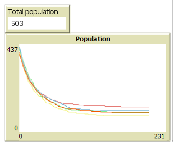
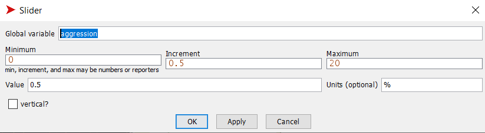
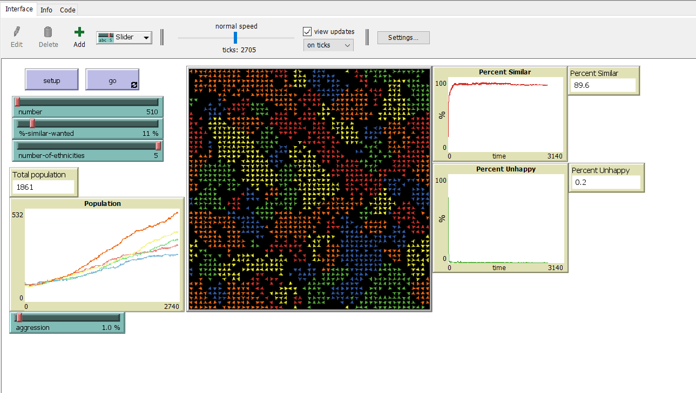
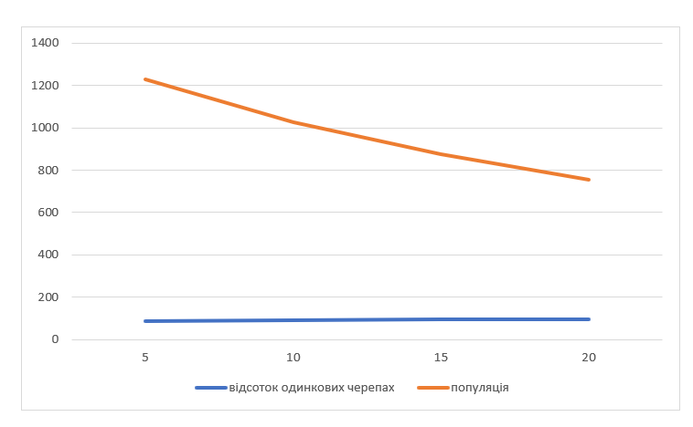

## Комп'ютерні системи імітаційного моделювання
## СПм-22-5, **Зубенко Сергій Петрович**
### Лабораторна робота №**2**. Редагування імітаційних моделей у середовищі NetLogo

### Варіант 8, модель у середовищі NetLogo:

[Segregation Simple Extension 1.](http://www.netlogoweb.org/launch#http://www.netlogoweb.org/assets/modelslib/IABM%20Textbook/chapter%203/Segregation%20Extensions/Segregation%20Simple%20Extension%201.nlogo)

 

### Внесені зміни у вихідну логіку моделі, за варіантом:

**Додати можливість агенту зникнути, вірогідність чого залежить від кількості наявних поряд з ним "чужих" і кількості представників їхньої групи у їх власному оточенні** 

Додано змінну, яка відповідає за агресивність черепах. Тобто, шанс нападу та вбивство одна одної. Її значення 5%.
<pre>
  aggression
</pre>

Створену процедуру, яка відповідає за вбивство черепах, якщо їх "ворожих" сусідів більше ніж "своїх". Кожен ворожй сусід збільшує шанс смерті на 5%. Кожен свій зменшує на 5%. Процедура викликається на кожному тікі симуляції.

<pre>
to compete
  ask turtles[
  let enemies (total-nearby - similar-nearby)
  if (enemies * aggression) - (similar-nearby * aggression * 0.8) > random-float 100 [die]
  ]
end
</pre>

**Виводити графік зміни розміру популяції.**

Додано графік зміни розміру популяції. Кожен колір відповуідає кожній групі черепах. Монітор виводить загальну кількість популяції.

### Внесені зміни у вихідну логіку моделі, на власний розсуд:

**Додано відтворення черепах**
Для цього створену процедуру. Якщо кількість черепах на полі не перевищує максимального значення і є вільне місце біля черепах і вона щаслива, то вона зможе розмножитись з вірогідністю в 0.1%.

<pre>
to reproduce
  ask turtles [
    if 0.1 > random-float 100 and count turtles < 2500 and total-nearby < 8 and happy?
    [ hatch 1 [ lt 45 fd 1 set happy? false]]
  ]
end
</pre>

**Додано можливість змінювати агресивність черепах**
Для цього додано слайдер:

**Невеликі покращення**
Було помічено, що одинокі черепахи без судів вважаються щасливими. Це виправлено. Тепер черепаха може бути щасливаою, якщо є хочаб один сусід.
<pre>
to update-turtles
  ...
   if total-nearby = 0 [set happy? false]
  end
</pre>

В процедурі *go* прописано, що якщо всі черепах щасливі, то треба зупинити симулцію. Тепер це не актуально, адже екосистемі тепер складніше вийти в таку рівновагу. Тому це було вимкнено.
<pre>
 to go
   ;;if all? turtles [happy?] [ stop ]
   ...
 end
</pre>

Фінальний код моделі та її інтерфейс доступні за [посиланням](SegregationSimpleExtension2.nlogo). 
 
  
## Обчислювальні експерименти
### 1. Вплив агреивності на відсоток одинкових черепах та популяцію
Досліджується залежність агреивності на відсоток одинкових черепах та популяцію через 50 тіків.
Експерименти проводяться при 5-20 аресивності, з кроком 0, усього 4 симуляцій.  
Інші керуючі параметри мають значення за замовчуванням:
-   **number**: 2000;
-   **%-simular-wanted**: 30;
-   **number-of-ethnicities**: 3;

<table>
<thead>
<tr><th>агресивність</th><th>відсоток одинкових черепах</th><th>популяція</th></tr>
</thead>
<tbody>
<tr><td>5</td><td>89</td><td>1229</td></tr>
<tr><td>10</td><td>93</td><td>1028</td></tr>
<tr><td>15</td><td>94</td><td>875</td></tr>
<tr><td>20</td><td>95</td><td>753</td></tr>
</tbody>
</table>

Графік наочно показує, що із зростанням рівня агресивності спостерігається зменшення загальної популяції черепах.  Зі збільшенням агресивності відсоток однакових черепах також зростає. Це може відбуватись внаслідок взаємних агресивних дій, які можуть призводити до зменшення шансів на виживання, але не дивлячись на це ількість щасливих черепах росте.
